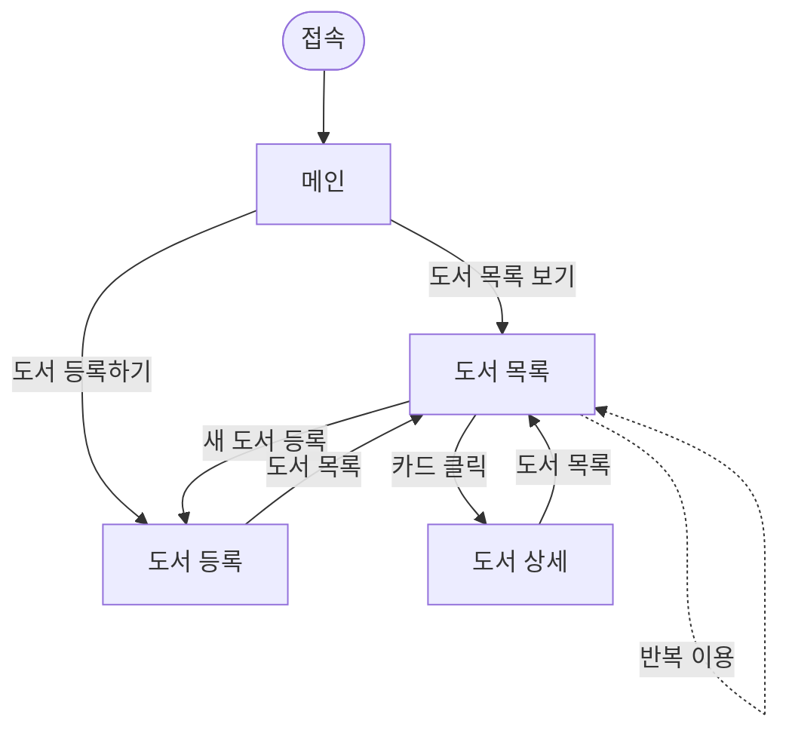
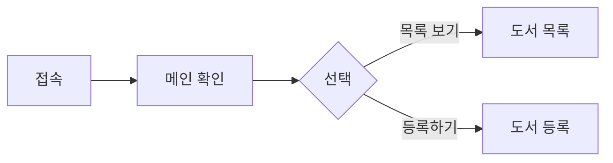
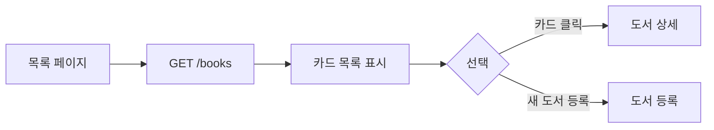
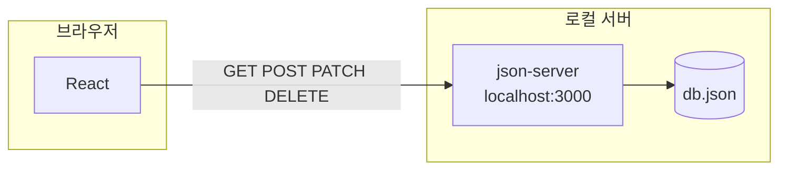
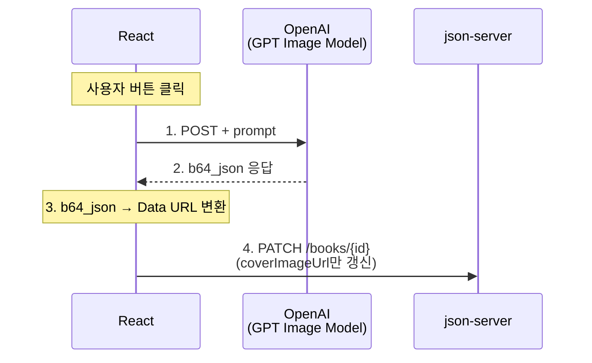

# AI 표지 생성을 지원하는 도서관리 시스템 (Frontend)

**React + fetch + CRUD**를 실제 프로젝트에 적용 및 외부 API(**OpenAI**)로 도서 표지를 자동 생성하는 웹 서비스

> 백엔드는 `json-server`로 대체하며, 이후 Backend Mini-Project에서 **Spring Boot**로 교체할 예정

---

## 팀 멤버 및 R&R

| 역할 | 담당 |
| --- | --- |
| 조장 / PM, 기획 | 홍수현 |
| 발표자 / UI, 레이아웃 | 최현준 |
| CRUD 연동 | 오희주, 강민욱 |
| OpenAI 연동 | 정무영 |
| 스타일링, QA | 이휘, 김채린 |
| 발표자료, 문서 | 조영웅 |

---

## 학습 목표

- 강의에서 학습한 **React + fetch + CRUD** 개념을 실제 프로젝트에 적용
- 외부 API(**OpenAI**) 연동 경험 확보

---

## 기술 스택

| 구분 | 기술 |
| --- | --- |
| **Frontend** | React 19, Vite, fetch (네이티브 API) |
| **Data (Mock Backend)** | json-server (로컬 REST API) |
| **AI 연동** | OpenAI API (GPT Image 모델 — 표지 생성) |
| **협업·배포** | GitHub, Vercel |

---

## SWF — 화면 흐름

메인에서 진입한 뒤 **목록 ↔ 등록 ↔ 상세**를 오가며 도서를 조회·등록하는 흐름입니다.



---

## 화면 구성

| 화면 | 컴포넌트 | 설명 |
| --- | --- | --- |
| 메인 | `HomePage` | 서비스 소개 및 주요 기능 진입 |
| 도서 목록 | `BookListPage` | 등록된 도서 카드 목록 조회 |
| 도서 등록 | `BookDetailPage` (`mode: create`) | 도서 정보 입력·AI 표지 생성·등록 |
| 도서 상세 | `BookDetailPage` (`mode: view`) | 선택한 도서 상세 조회 (수정·삭제) |

화면 전환은 `App.jsx`의 `currentView`(`home` · `list` · `detail`)와 `detailMode`(`create` · `view`)로 제어합니다.

---

## 실행 방법

### 1. 패키지 설치

```bash
npm install
```

### 2. json-server 실행

```bash
npx json-server --watch db.json --port 3000
```

도서 데이터 확인 주소

```text
http://localhost:3000/books
```

### 3. React 개발 서버 실행

새 터미널에서 React 개발 서버 실행

```bash
npm run dev
```

브라우저 접속 주소

```text
http://localhost:5173
```

React 개발 서버와 json-server는 각각 별도 실행 필요  
터미널 2개를 열어 동시에 실행

---

## 주요 기능

### 도서 등록
책 제목, 저자, 내용을 입력해 새로운 도서 등록  
입력한 도서 정보는 `POST /books` 요청으로 `db.json`에 저장

### 도서 목록 조회
등록된 도서를 카드 형태로 조회  
도서 제목, 표지, 요약 내용을 한눈에 확인  
표지가 없는 경우 기본 표지 표시

### 도서 검색
도서 목록에서 제목 또는 저자 기준으로 원하는 도서 검색  

### 도서 상세 조회
도서 목록에서 카드를 클릭해 선택한 도서의 상세 정보 확인  
제목, 저자, 내용, 표지, 작성일, 수정일 정보 표시

### 도서 수정 및 삭제
상세 화면에서 기존 도서 정보 수정 또는 삭제  
수정은 `PATCH /books/{id}`, 삭제는 `DELETE /books/{id}` 요청으로 처리

### AI 표지 생성
도서 제목과 내용을 기반으로 OpenAI API 호출  
생성된 표지는 `coverImageUrl`에 저장 후 도서 목록과 상세 화면에 반영

---

## 화면 스크린샷

GitHub 웹에서 README 편집 시, 각 소제목 아래에 스크린샷을 붙여넣으면 됩니다.

### 메인


### 도서 목록


### 도서 등록


---

## 페이지별 요구사항

### 메인 페이지

- 서비스명·안내 문구로 서비스 목적 소개
- **도서 목록 보기** · **도서 등록하기** 버튼으로 각 화면 이동



---

### 도서 등록 페이지

- 책 제목·저자·내용 입력 후 `POST /books`로 등록
- API Key(마스킹), 품질(High / Middle / Low)로 AI 표지 생성 → `coverImageUrl` 저장
- 미생성 시 기본 표지, 필수값·API·생성 실패 시 에러 안내


---

### 도서 목록 페이지

- 진입 시 `GET /books`로 목록 조회, 카드(제목·표지·요약) 표시
- `coverImageUrl` 없으면 기본 표지, 빈 목록 시 안내 문구
- 카드 클릭 → 상세(`id`), **새 도서 등록** → 등록 화면



---

## 프로젝트 구성도

### CRUD — 도서 데이터 관리



- **Frontend:** React(브라우저)에서 REST API 호출 (`GET`, `POST`, `PATCH`, `DELETE`)
- **Mock Backend:** `json-server` (`localhost:3000`)
- **저장소:** `db.json`

### AI — 표지 자동 생성



1. React에서 사용자가 표지 생성 버튼 클릭
2. `prompt`와 함께 OpenAI(GPT Image Model)에 `POST` 요청
3. 응답의 `b64_json`을 Data URL로 변환
4. `PATCH /books/{id}`로 `coverImageUrl`만 json-server에 저장

---

## API 엔드포인트 (json-server 기준)

| 구분 | 서비스명 | API 이름 | Method | REST API |
| --- | --- | --- | --- | --- |
| 조회 | BookList | 목록 조회 | GET | `/books` |
| 등록 | BookCreate | 도서 등록 | POST | `/books` |
| 수정 | BookUpdate | 도서 수정 | PATCH | `/books/{id}` |
| 삭제 | BookDelete | 도서 삭제 | DELETE | `/books/{id}` |
| 조회 | BookDetail | 도서 상세 조회 | GET | `/books/{id}` |
